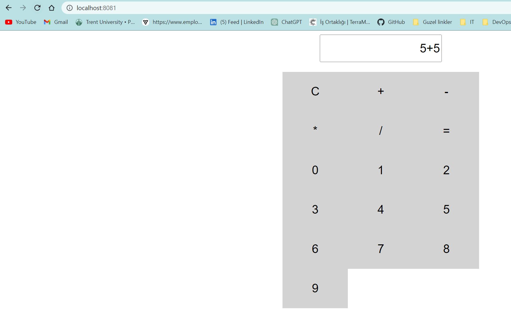

# Calculator Web Application

The calculator web application that performs basic arithmetic operations. This application is built using HTML, CSS, and JavaScript, and can be run using Docker.



### Build the Docker image by running the following command in your terminal:

```
docker build -t calculator-web-app .
```

### Run the Docker container:

```
docker run -d -p 8081:80 calculator-web-app
```

Open your web browser and navigate to http://localhost:8081


## Built With
+ HTML: Used to create the structure and content of the web page.
+ CSS: Used to style the web page.
+ JavaScript: Used to add interactivity and perform arithmetic operations.
+ Docker: Used to run the application in a container.
